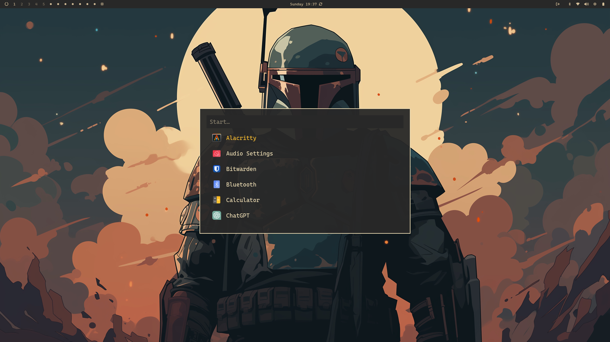

# MyDotfile



This is my personal configuration for a productive and enjoyable Linux environment. It's built around Hyprland on Arch Linux and includes tools I use daily. While I did take inspiration from various amazing dotfile setups shared by the community, these configs have been carefully tweaked by me to suit my own workflow and preferences.

## Tools Included

- **Hyprland** — Wayland compositor I rely on for a smooth graphical experience
- **Kitty** — My favorite terminal emulator, powerful and flexible
- **Alacritty** — Another terminal I use; simple and fast, though it lacks image rendering
- **Lazygit** — Handy terminal UI for Git operations
- **Neovim** — The best text editor I’ve used, highly configurable
- **Tmux** — Terminal multiplexer to manage multiple sessions efficiently
- **Bash** — The classic shell that still gets the job done
- **Starship** — My shell prompt for a clean, informative terminal look

## Neovim & Tmux


## What’s Next (TODO)

- [ ] Add custom scripts automation
- [ ] Integrate better clipboard management

## Installation Guide

### 1. Remove Old Configs (to avoid conflicts)

```
rm ~/.bashrc
rm -r ~/.config/alacritty
rm -r ~/.config/hypr
rm -r ~/.config/kitty
rm -r ~/.config/lazygit
rm -r ~/.config/nvim
rm -r ~/.config/tmux
```

### 2. Clone the Repository

```
git clone https://github.com/theamit-969/dotfiles.git

cd dotfiles
```

### 3. Create Symlinks

From inside the `dotfiles` folder:

```
stow .
```

## What is Symlinking?

Symlinking (symbolic linking) is like creating a shortcut.  
It **points from the location where your system expects configs** → **to the version inside your dotfiles folder**.

- **Source:** the config in your dotfiles folder (e.g., `~/dotfiles/nvim`)
- **Target:** where the system looks for it (e.g., `~/.config/nvim`)

This way, you update configs in one place and your system will always use the latest version.
